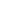

# 🪐 AOZ 클론코딩 진행상황 & 개발 가이드

---

## 📌 1. 프로젝트 진행 현황 요약

| 구역 | 내용 | 상태 | 비고 |
| :--- | :--- | :---: | :--- |
| **Header** | **상단바 (로고, 텍스트 메뉴, 아이콘 메뉴)** | **✅ 완료 (100%)** | 구조, 직관적인 네이밍, CSS 매칭 완료 |
| **CSS 구조** | **`css/` 폴더 분리 (초기화, 애니메이션, 스타일)** | **✅ 완료 (100%)** | `normal.css`, `animation.css`, `style.css` |
| **Section 01** | 상단 메인 이미지 풀배너 | ⏳ 대기 (0%) | 다음 작업 시작점 |
| **Section 02** | 브랜드 소개 (ALIEN ODORZ) | ⏳ 대기 (0%) | 텍스트/버튼 컨테이너 정리 예정 |
| **Section 03** | 롤링 상품 영역 | ⏳ 대기 (0%) | `product01` 중복 방지 및 슬라이더 구조 점검 |
| **Section 04** | 그리드 배너 (4분할) | ⏳ 대기 (0%) | `sec04-strong` 컨테이너 구조 개선 예정 |
| **Section 05** | 일반 상품 목록 그리드 | ⏳ 대기 (0%) | 대문자 클래스(`General-product`) 및 세로 정렬 개선 |
| **Section 06** | 하단 이미지 풀배너 | ⏳ 대기 (0%) | Section 01과 공통 스타일 점검 |
| **Footer** | 하단바 (푸터 로고 및 메뉴) | ⏳ 대기 (0%) | 최종 레이아웃 점검 |

---

## 💎 2. 확정된 코드 규칙

### [CSS 폴더 & 파일 역할]
* **`css/normal.css`** : AOZ 프로젝트 기본 설정(`body`, `strong`) + 브라우저 기본 태그 초기화(Reset)
* **`css/animation.css`** : `@keyframes bgChange` 및 모션/애니메이션 모음
* **`css/style.css`** : 상단바(`header`), 본문(`main`), 하단바(`footer`)의 레이아웃 및 디자인 클래스

### [HTML 상단바 구조]
```html
<header>
    <div class="top-bar">
        <!-- 1. 로고 -->
        <h1 class="logo">
            <a href="#"></a>
        </h1>

        <!-- 2. 우측 전체 메뉴 영역 -->
        <div class="right-menu">
            <!-- 2-1. 메인 글자 메뉴 -->
            <nav class="text-menu">
                <ul class="text-ul">
                    <li class="text-item"><a href="https://alienodorz.com/product/list.html?cate_no=23" target="_top">SHOP</a></li>
                    <li class="text-item"><a href="#" target="_top">ODORZ TEST</a></li>
                    <li class="text-item"><a href="#" target="_top">BRAND STORY</a></li>
                </ul>
            </nav>

            <!-- 2-2. 우측 아이콘 메뉴 -->
            <div class="icon-menu">
                <ul class="icon-ul">
                    <li class="icon-item"><a href="#" target="_blank" title="마이페이지"></a></li>
                    <li class="icon-item"><a href="#" target="_blank" title="장바구니"></a></li>
                    <li class="icon-item"><a href="#" target="_blank" title="검색"></a></li>
                    <!-- 언어 설정 드롭다운 -->
                    <li class="icon-item icon-lang">
                        <a href="#" title="언어설정"></a>
                        <div class="lang-dropdown">한국어</div>
                    </li>
                    <li class="icon-item"><a href="#" target="_blank" title="전체메뉴"></a></li>
                </ul>
            </div>
        </div>
    </div>
</header>
```

### [네이밍 포인트]
* `text-menu` vs `icon-menu`로 명확한 대칭 구조 형성
* `text-item`, `icon-item`으로 불필요한 번호 클래스(`01~05`) 제거
* 특수 항목만 `icon-lang`, `lang-dropdown`으로 직관적 명명

---

## 🚀 3. 다음 작업 시 점검할 섹션별 가이드

다음에 작업을 재개할 때 아래 순서대로 확인하면서 수정하시면 됩니다:

### 1️⃣ Section 01 (상단 메인 이미지 배너)
* 풀스크린 이미지 배너 너비 및 `object-fit: cover` 확인

### 2️⃣ Section 02 (브랜드 소개)
* 불필요한 div 래핑(`sec02-item-text01`) 제거
* `strong`, `p`, `button`(또는 `a` 태그)으로 시맨틱하게 정리

### 3️⃣ Section 03 (롤링 상품) & Section 04 (그리드 배너)
* **주의**: `.product01`, `.product02`... 가 여러 섹션에서 중복 사용 중이므로 섹션별 고유 클래스명으로 분리 필요
* Section 04의 `<div class="sec04-strong">` 태그 명칭과 구조 개선

### 4️⃣ Section 05 (일반 상품 그리드)
* 대문자 클래스 `.General-product` ➡️ 소문자 케밥케이스 `.general-product` (또는 `.product-grid`)로 변경
* `sec05-product`에 `flex-direction: column;`을 적용하여 이미지 아래에 상품명/가격이 오도록 세로 정렬
* `sec05-text01`, `text02`, `text03` ➡️ `product-name`, `product-size`, `product-price` 등으로 직관화

### 5️⃣ Footer (하단바)
* 푸터 좌/우 배치 및 로고 스타일 최종 확인

---

> 💡 **다음에 다시 작업하실 때:**  
> "PROGRESS.md 보고 Section 01부터 시작하자"라고 말씀해 주시면 바로 이어서 진행할 수 있습니다!
